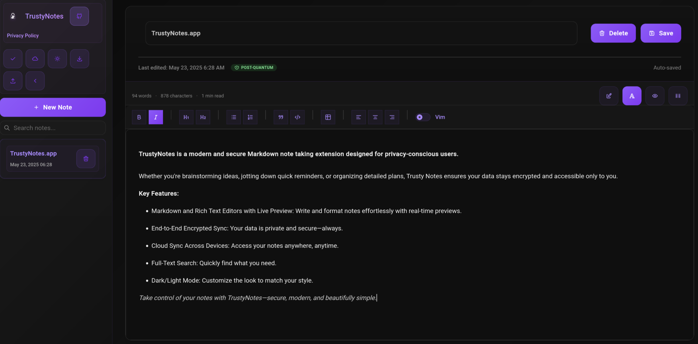

# Trusty Notes

A secure cross-platform note-taking application. Features end-to-end encryption for cloud sync and a modern React frontend.

https://notes.toolworks.dev

<p align="center">
<a href="https://addons.mozilla.org/en-US/firefox/addon/trustynotes/"></a>
<a href="https://chromewebstore.google.com/detail/trustynotes/jbofhocadlfnlhgjkcnbldobinlfghei?authuser=1&hl=en"></a><br>
</p>



## Features

- 📝 Markdown editor with live preview
- 🔄 Secure cloud synchronization
- 🔐 End-to-end encryption
- 🌙 Dark/Light mode
- 💾 Automatic saving
- 🔍 Full-text search
- 📱 Cross-platform
- 💾 Import/Export functionality
- 🔒 Seed phrase-based encryption

## To-Do
- [x] Improved Sync
- [x] Rich Text
- [x] Browser Extension
- [ ] Attachments/Files
- [ ] Add Alternative to Seedphrase

## Client Self-Hosting

### Prerequisites
- Docker
- Docker Compose

### Setup & Run
```
git clone https://github.com/toolworks-dev/trusty-notes
cd trusty-notes
docker compose up --build -d
```

## Server Self-Hosting

### Prerequisites
- Docker
- Docker Compose

### Setup
```
git clone https://github.com/toolworks-dev/trusty-notes
cd trusty-notes/server
```

### Database
```
vim .env

MONGO_USERNAME=
MONGO_PASSWORD=
```

### Run
```
docker compose up --build -d
```

## Build Browser Extension

### Requires
- Bun (https://bun.sh)

### Build

```
bun install
./build-extension.sh
```

This Builds the Chrome and Firefox extensions and places them in the `browser-extension/web-ext-artifacts` directory. You can install the extension directly from the .zip in firefox, you must extract the .zip for chrome/chromium browsers and load the unpacked folder.
